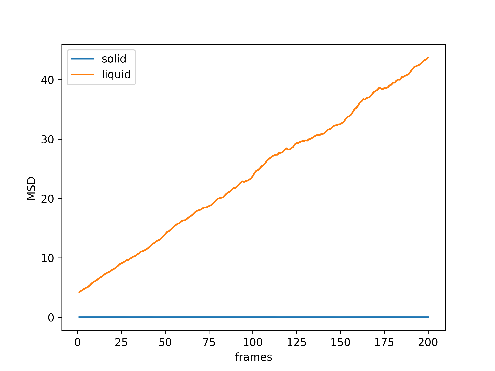

Tutorial
========

In this tutorial we will use *exma* to calculate some properties of a Lennard-Jones fluid in a solid (fcc) and in a liquid phase. The data was generated using a homemade `MD code`_. The trajectory and thermo files are in 'exma/docs/source/_statics/'. The scripts of python using here can be found in 'exma/docs/source/_templates/'. Not all exma modules will be used but much of them will be covered. If you want to use another module, you can read the API and replicate what is done below.

.. _MD code: https://github.com/fernandezfran/fiscomp2020/tree/master/labo5-Molecular_dynamics/02/c

----------------------------------------------------------------------------------

Coordination number (CN)
------------------------

The coordination number(CN), also called ligancy, of a given atom in a chemical system is defined as the number of atoms, molecules or ions bonded to it. *exma* calculate this quantity considered the number of neighbors surrounding a given atom type a cutoff distance.

.. code-block:: python

    #!/usr/bin/env python3
    # -*- coding: utf-8 -*-
    #
    # in this script the coordination numbers of sc, bcc and fcc crystals are 
    #   calculated, the steps are following for each system:
    #
    #       1. with exma.atoms.positions generate the positions of the atoms
    #           the first argument is the number of atoms and the second the box size
    #
    #       2. with exma.cn.monoatomic initializate the CN calculation
    #           the first argument is the number of atoms, the second the box size
    #           in each direction and the third is a cutoff distance
    #
    #       3. with CN.accumulate calculate de CN of this "frame"
    #           the argument is the positions of the atoms
    #
    #       4. with CN.end return the CN of each atom
    #           the first argument is the atom type to be written (not interested here)
    #           the second are the positions and the third is False to not write an
    #           output file
    #
    import numpy as np
    import exma

    sc = exma.atoms.positions(8, 4.0).sc()
    cn_sc = exma.cn.monoatomic(8, np.full(3, 4.0), 3.0)
    cn_sc.accumulate(sc)
    cn_sc = np.mean(cn_sc.end(0, sc, False))

    bcc = exma.atoms.positions(16, 4.0).bcc()
    cn_bcc = exma.cn.monoatomic(16, np.full(3, 4.0), 1.8)
    cn_bcc.accumulate(bcc)
    cn_bcc = np.mean(cn_bcc.end(0, bcc, False))

    fcc = exma.atoms.positions(32, 4.0).fcc()
    cn_fcc = exma.cn.monoatomic(32, np.full(3, 4.0), 1.5)
    cn_fcc.accumulate(fcc)
    cn_fcc = np.mean(cn_fcc.end(0, fcc, False))

    print("#  %d is the coordination number of a sc crystal" % cn_sc)
    print("#  %d is the coordination number of a bcc crystal" % cn_bcc)
    print("# %d is the coordination number of a fcc crystal" % cn_fcc)

----------------------------------------------------------------------------------

Radial distribution function (RDF)
----------------------------------

The pair radial distribution function (RDF), *g(r)*, characterizes the local structure of a fluid, and describes the probability to find an atom in a shell at distance *r* from a reference atom. *exma* calculate this quantity as the ratio between the average density at distance *r* from the reference atom and the density at that same distance of an ideal gas. For more information you can start reading `rdf`_.

.. _rdf: https://en.wikipedia.org/wiki/Radial_distribution_function

First of all, we must import the necessary libraries at the beggining of the script in python.

.. code-block:: python
    
    #!/usr/bin/env python3
    # -*- coding: utf-8 -*-
    #
    # Python script to calculate the RDF of a LJ fluid in a solid and in a liquid 
    #   phase
    #
    import numpy as np
    import matplotlib.pyplot as plt

    import exma

Before starting we need some infomation: the number of particles, the number of frames and the box size. Except for the number of particle, the rest of the information is not in a typical ``.xyz`` file. We define those variables in our python script.

.. code-block:: python

    N = 500
    frames = 201
    ssize = np.full(3, 7.46901)

``np.full()`` will give us an array of three components with the same value, *i.e.* the box is cubic. Then, we use ``exma.reader.xyz`` to open the ``.xyz`` file located in 'exma/docs/source/_static/lj-fcc.xyz' and we start with ``exma.rdf.monoatomic`` declaring the number of particles of the system, the box size and the number of bins that will be considered in the histogram.

.. code-block:: python

    solid = exma.reader.xyz("../_static/lj-fcc.xyz")
    srdf = exma.rdf.monoatomic(N, ssize, 75)

Now we can iterate along the frames that we have in our trajectory file, reading each frame with ``solid.read_frame()`` (solid is the object that we had created) and accumulated the information of the RDF using ``srdf.accumulate(sx)`` (srdf  is the object that we had created and sx are the positions of the atoms).

.. code-block:: python

    for i in range(0, frames):
        sN, styp, sx = solid.read_frame()
        srdf.accumulate(sx)

``solid.read_frame()`` returns us the number of particles *sN*, the type of atoms *styp* and the positions *sx*, that are the parameter that we need to use ``srdf.accumulate(sx)``.

When the ``for`` loop finishes, we must close the file where the trajectories are ``solid.file_close()`` and get the information of the histogram *g(r)* with ``sr, sgofr = srdf.end(False)``, a ``False`` value is passed because the default ``True`` will write the information in an output file.

.. code-block:: python

    sr, sgofr = srdf.end(False)
    solid.file_close()

Now we have the *x* of the histogram in *sr* and the *y* in *sgofr*.

Following the same steps we can do the same for the liquid phase.

.. code-block:: python
    
    lsize = np.full(3, 8.54988) 

    liquid = exma.reader.xyz("../_static/lj-liquid.xyz")
    lrdf = exma.rdf.monoatomic(N, lsize, 75)

    for i in range(0, frames):
        lN, ltyp, lx = liquid.read_frame()
        lrdf.accumulate(lx)

    lr, lgofr = lrdf.end(False)
    liquid.file_close()
    
With ``matplotlib.pyplot`` we can configure some options 

.. code-block:: python
    
    plt.xlabel("r*")
    plt.ylabel("g(r)")
    plt.xlim(0.0, 4.0)
    plt.hlines(1.0, 0.0, 4.0, colors='k', ls='dashed')
    plt.plot(sr, sgofr, label='solid')
    plt.plot(lr, lgofr, label='liquid')
    plt.legend()
    plt.savefig('rdf.png', dpi=600)
    plt.show()

and get the following graph.

.. figure:: _templates/rdf.png
   :alt: RDF solid and liquid 
   :height: 768px
   :width: 1024px
   :scale: 50 %
   :align: center
   :figwidth: 80 %
   
   RDF for solid (blue line) and liquid (green line) phase. The *x* label is in LJ units of distance.

We get the expected results. For the solid phase we have the defined peaks of an *fcc* crystal with noise given by the temperature and for the liquid phase we get the usual behavior of a liquid. For both systems we have that the *g(r)* oscillates around 1.

----------------------------------------------------------------------------------

Mean square displacement (MSD)
------------------------------

The mean square displacement (MSD) is a measure of the deviation of the position of the particles with respect to a reference positions over time. From it, it is possible to obtain, through a linear regression, the diffusion coefficient. For more information you can start reading `MSD`_.

.. _MSD: https://en.wikipedia.org/wiki/Mean_squared_displacement

As in the RDF example, we first import the necessary libraries and define the information needed.

.. code-block:: python
    
    #!/usr/bin/env python3
    # -*- coding: utf-8 -*-
    #
    # Python script to calculate the MSD of a LJ fluid in a solid and in a liquid 
    #   phase
    #
    import numpy as np
    import matplotlib.pyplot as plt

    import exma

    N = 500
    frames = 201

We must read the ``.xyz`` file but taking into account that now we need the image boxes of the particles, so to ``exma.reader.xyz`` we pass the argument ``'image'`` to indicate that type of file and that we want the information that it is in the last three columns.

.. code-block:: python
    
    ssize = np.full(3, 7.46901) 

    solid = exma.reader.xyz("../_static/lj-fcc.xyz", 'image')

    sN, styp, sx, simg = solid.read_frame()
    sMSD = exma.msd.monoatomic(N, ssize, sx)

We also initializate the object ``sMSD`` by reading the first frame and passing the number of particles in the system, the box size and the positions that will be used as reference positions. Then, we will have to iterate along frames but without considering the first one. So the ``for`` loop goes till ``frames - 1``.

.. code-block:: python
    
    st, smsd = [], []
    for i in range(0, frames - 1):
        sN, styp, sx, simg = solid.read_frame()
        t, msd = sMSD.wrapped(sx, simg)

        st.append(t)
        smsd.append(msd)

The lists ``st`` and ``smsd`` were created to save the time [frame] and the corresponding msd of the actual frame. The data is obtained from using the function ``wrapped`` that has the actual positions and image box as arguments.

When the loop finishes, we close the file and convert the lists to numpy arrays.

.. code-block:: python
    
    solid.file_close()
    st = np.asarray(st)
    smsd = np.asarray(smsd)

The same can be done to the liquid phase.

.. code-block:: python

    lsize = np.full(3, 8.54988) 

    liquid = exma.reader.xyz("../_static/lj-liquid.xyz", 'image')

    lN, ltyp, lx, limg = liquid.read_frame()
    lMSD = exma.msd.monoatomic(N, lsize, lx)

    lt, lmsd = [], []
    for i in range(0, frames - 1):
        lN, ltyp, lx, limg = liquid.read_frame()
        t, msd = lMSD.wrapped(lx, limg)

        lt.append(t)
        lmsd.append(msd)

    liquid.file_close()
    lt = np.asarray(lt)
    lmsd = np.asarray(lmsd)

After the analysis is completed we can use ``matplotlib.pyplot``

.. code-block:: python
    
    plt.xlabel("frames")
    plt.ylabel("MSD")
    plt.plot(st, smsd, label='solid')
    plt.plot(lt, lmsd, label='liquid')
    plt.legend()
    plt.savefig('msd.png', dpi=600)
    plt.show()

to get the following graph

   
   MSD for solid (blue line) and liquid (green line) phase. The *x* label are the frames, to calculate the diffusion coefficient they must be transformed to time units.

We get that the liquid phase is diffusing with the linear expected behaivor and the solid phase is not diffusing.
