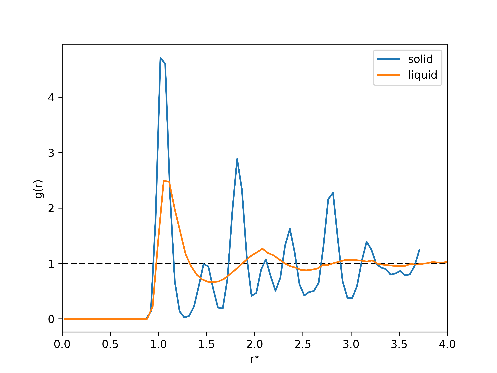

Tutorial
========

In this tutorial we will use *exma* to calculate some properties of a Lennard-Jones fluid in a solid (fcc) and in a liquid phase. The data was generated using a homemade MD code. The trajectory and thermo files are in 'exma/docs/source/_statics/'. The scripts of python using here can be found in 'exma/docs/source/_templates/'. Not all exma modules will be used but much of them will be covered. If you want to use another module, you can read the API and replicate what is done below.

----------------------------------------------------------------------------------

Radial distribution function (RDF)
----------------------------------

The pair radial distribution function (RDF), *g(r)*, characterizes the local structure of a fluid, and describes the probability to find and atom in a shell at distance *r* from a reference atom. *exma* calculate this quantity as the ratio between the average density at distance *r* from the reference atom and the density at that same distance of an ideal gas. For more information you can start reading `rdf`_.

.. _rdf: https://en.wikipedia.org/wiki/Radial_distribution_function

First of all, we must import the necessary libraries at the beggining of the script in python.

.. code-block:: python
    
    #!/usr/bin/env python3
    # -*- coding: utf-8 -*-
    #
    # Python script to calculate the RDF of a LJ fluid in a solid and in a liquid 
    #   phase
    #
    import numpy as np
    import matplotlib.pyplot as plt

    import exma

Before starting we need some infomation: the number of particles, the number of frames and the box size. Except for the number of particle, the rest of the information is not in a typical ``.xyz`` file. We define those variables in our python script.

.. code-block:: python

    N=500
    frames = 201
    ssize = np.full(3, 7.46901)

``np.full()`` will give us an array of three components with the same value, *i.e.* the box is cubic. Then, we use ``exma.reader.xyz`` to open the ``.xyz`` file located in 'exma/docs/source/_static/lj-fcc.xyz' and we start with ``exma.rdf.monoatomic`` declaring the number of particles of the system, the box size and the number of bins that will be considered in the histogram.

.. code-block:: python

    solid = exma.reader.xyz("../_static/lj-fcc.xyz")
    srdf = exma.rdf.monoatomic(N, ssize, 75)

Now we can iterate along the frames that we have in our trajectory file, reading each frame with ``solid.read_frame()`` (solid is the object that we had created) and accumulated the information of the RDF using ``srdf.accumulate(sx)`` (srdf  is the object that we had created and sx are the positions of the atoms).

.. code-block:: python

    for i in range(0, frames):
        sN, styp, sx = solid.read_frame()
        srdf.accumulate(sx)

``solid.read_frame()`` returns us the number of particles *sN*, the type of atoms *styp* and the positions *sx*, that are the parameter that we need to use ``srdf.accumulate(sx)``.

When the ``for`` loop finishes, we must close the file where the trajectories are ``solid.file_close()`` and get the information of the histogram *g(r)* with ``sr, sgofr = srdf.end(False)``, a ``False`` value is passed because the default ``True`` will write the information in an output file.

.. code-block:: python

    sr, sgofr = srdf.end(False)
    solid.file_close()

Now we have the *x* of the histogram in *sr* and the *y* in *sgofr*.

Following the same steps we can do the same for the liquid phase.

.. code-block:: python
    
    lsize = np.full(3, 8.54988) 

    liquid = exma.reader.xyz("../_static/lj-liquid.xyz")
    lrdf = exma.rdf.monoatomic(N, lsize, 75)

    for i in range(0, frames):
        lN, ltyp, lx = liquid.read_frame()
        lrdf.accumulate(lx)

    lr, lgofr = lrdf.end(False)
    liquid.file_close()
    
With ``matplotlib.pyplot`` we can configure some options 

.. code-block:: python
    
    plt.xlabel("r*")
    plt.ylabel("g(r)")
    plt.xlim(0.0, 4.0)
    plt.hlines(1.0, 0.0, 4.0, colors='k', ls='dashed')
    plt.plot(sr, sgofr, label='solid')
    plt.plot(lr, lgofr, label='liquid')
    plt.legend()
    plt.savefig('rdf.png', dpi=600)
    plt.show()

and get the following graph.

   
   RDF for solid (blue line) and liquid (green line) phase. The *x* label is in LJ units of distance.

We get the expected results. For the solid phase we have the defined peaks of an *fcc* crystal with noise given by the temperature and for the liquid phase we get the usual behavior of a liquid. For both systems we have that the *g(r)* oscillates around 1.

Calculating the RDF of a diatomic system should not cause major problems after this example.

----------------------------------------------------------------------------------

Mean square displacement (MSD)
------------------------------
